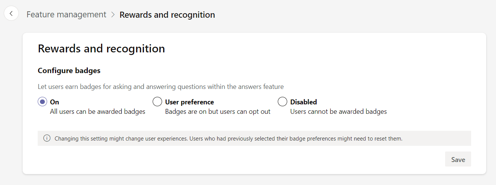

# Lab 1 – Install and setting up Answers in Viva Engage for the users

### Objective

This Lab guides you through the configuring the Answers and options available in Viva Engage.

### Exercise 1 – Pinning Viva Engage to Users' Teams Interface

1.  Open the [Teams](https://teams.microsoft.com/v2/) Apps or switch
    back to the Teams app if it already launched.

2.  Select the horizontal three dots on the left navigation pane. Enter
    **Engage** in the search bar. Right click on the correct app and
    click on **Pin.**

3.  The app is pinned to the left navigation pane.

4.  Select the Viva Engage app. You will be navigated to the Homepage.

## Exercise 2 – Exploring Knowledge Sharing Experience

### Task 1 – Configuring Rewards and Recognition for Participation

1.  In the Viva Engage Teams app, select the ellipses button beside your
    admin username. Select **Admin** to open the Admin center.

2.  Select the Feature management tab, select Rewards and recognition.

3.  Configure badges by selecting from these options

    1.  **On** enables badges for the organization.

    2.  **User Preference** enables badges for the organization while
        allowing individuals to opt out. The end user can turn off
        badges in Viva Engage by selecting the ellipses button on the
        right of their Achievements and awards page.

    3.  **Disabled** turns badge off in Answers in Viva. If you switch
        this control from On to Disabled, all badges earned by users are
        deleted and unrecoverable. Answers stops collecting user data
        for badges.

4.  Please select **On.** Select **Save**

### Task 2 – Create a Campaign

1.  On the **Feature management** tab, select **Campaigns** to access
    the campaign dashboard.

2.  From the campaign dashboard, select **Create campaign** in the
    upper-right corner of the campaign dashboard.

3.  Enter the below details

    1.  **Campaign Hashtag** – Demo

    2.  **Description** - This Campaign is for demonstrating the concept

    3.  Select **Save**

4.  To publish the organization, select the ellipses button on the
    campaign management dashboard, and from the menu select **Publish
    campaign**.

5.  Select **Publish.**

### Task 3 – Setup Storylines

1.  On the **Feature management** tab, select **Storyline** to customize
    settings.

2.  Enable the storyline by toggling the button to **yes** under
    **Enable Storyline**

3.  Select **Edit** under **Advance Settings**

    1.  System default selections for notifications include the
        following options. Make sure all the three options are checked.

        1.  Teams notifications, which appear in the Teams Activity
            feed.

        2.  Email notifications. Email supports actionable messages,
            which lets users view and reply from Outlook Web Access.

        3.  Viva Engage notifications, which appear as Viva Engage
            notification bells.

    2.  Specify the Storyline creators, select Eligible users with Viva
        Engage Access

    3.  Select **Save.**

4.  

## Exercise 3 – Exploring the Advanced Administration in Viva Engage

Note - You must be a Microsoft 365 Global admin to configure Answers and
Answers-related options.

### Task 1 – Managing the Information Panel (Providing Guidance, Editing Content, Resetting)

#### Provide guidance using the information panel

As an Answers admin, Engage admin, or global admin, use the information
panel to provide guidance to employees on how to use Answers in your
organization. The information panel is only visible to administrators in
its default state. After an admin saves and publishes the information
panel, all other employees with access to Answers can see the
information panel.

#### Edit the information panel

1.  Select the edit icon from the top left corner of the information
    panel **(Add Answers guidelines)**

2.  You will enter the content specific to your organization.

3.  Select **Save and publish** to allow all Answers users access to the
    information panel content.

#### Reset the information panel

1.  Select the edit icon from the top left corner of the information
    panel.

2.  Select **Reset** from the bottom-left corner.

### Task 2 – Managing Topics in Answers (Featuring, Reviewing, Removing)

#### Create topics in Answers

1.  Select **Topics to follow** on the right-hand side of the page.

2.  Select **Create topic**

3.  Enter the below details

    1.  **Topic Name** - Viva Introduction

    2.  **Description** – Viva Introduction

    3.  Select **Create Topic**

#### Remove topics in Answers

To remove a topic in Answers, Answers admins (knowledge managers) follow
these steps:

1.  Go to the browse topics page in Answers.

2.  Select the ellipsis button on a topic, which prompts you to remove
    the topic in Answers.

3.  When a topic is removed, it disappears from Answers and is no longer
    associated with any questions where it was previously used.

### Summary

You have successfully completed Lab 1 understanding the features of Viva Engage.
