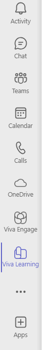
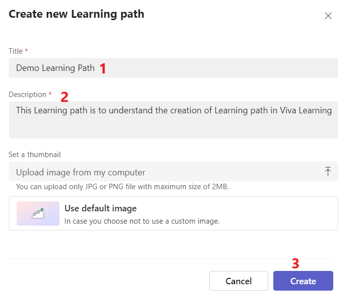
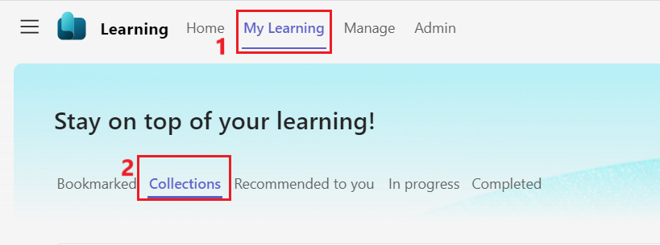
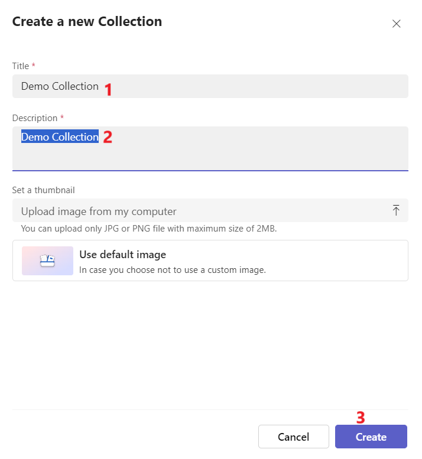
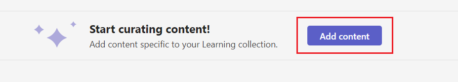
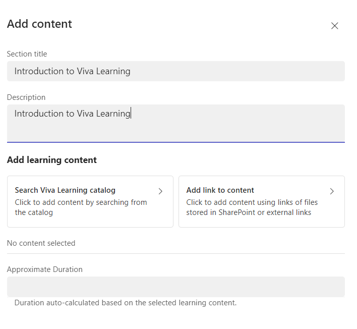
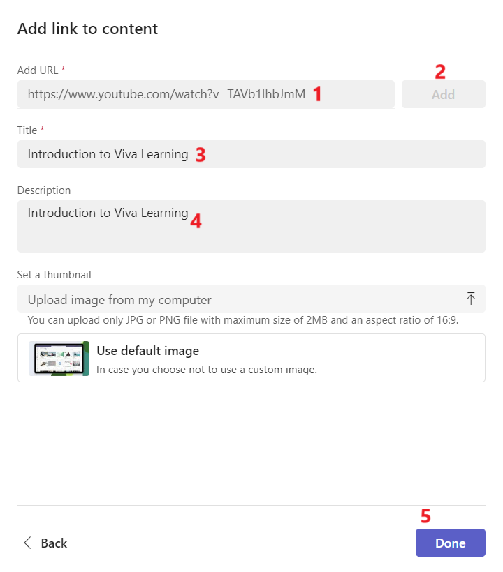
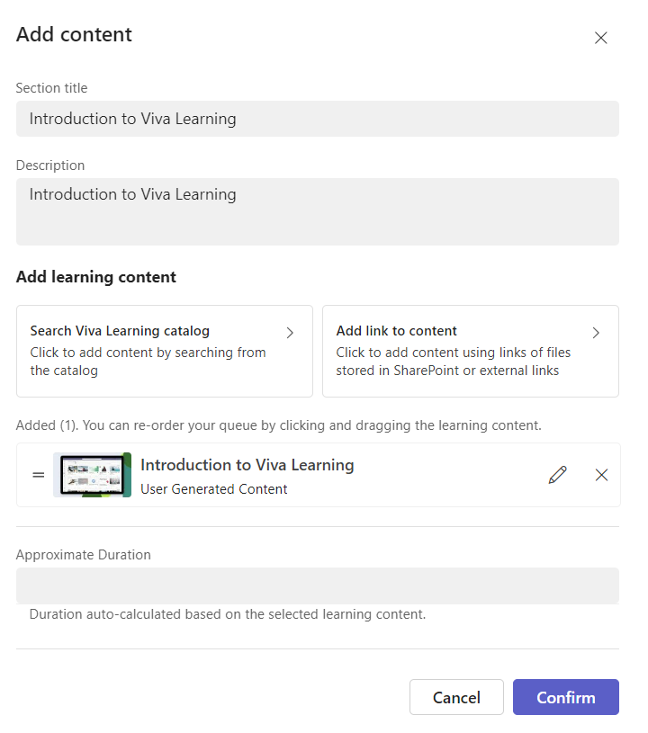
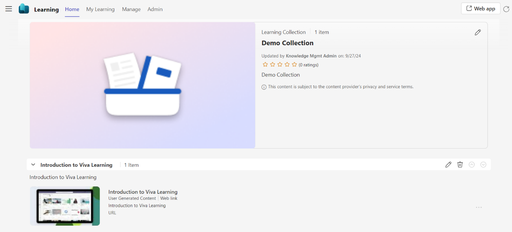

# Lab 3 – [Set up Microsoft Viva Learning in the Teams admin center](https://learn.microsoft.com/en-us/viva/learning/set-up-viva-learning)

## Exercise 1 – Pinning Viva Learning to Users' Teams Interface

1.  Open the teams Apps or switch back to the Teams app if it already
    launched.

2.  Select the horizontal three dots on the left navigation pane. Enter
    **Viva Learning** in the search bar. Right click on the correct app
    and click on **Pin.**

3.  The app is pinned to the left navigation pane.

4.  Select the Viva Engage app. You will be navigated to the Homepage.

## Exercise 2 – Managing Learning Content in Viva Learning

### Task 1 – Creating Learning Paths for Skill Development

1.  Once you are on the Home page of Viva Learning. Go to
    the **Admin** tab in Viva Learning.

2.  Select **Learning path** on the left menu.

> 

3.  Click **Create new**.

4.  Update the details.

    1.  **Title** – Demo Learning Path

    2.  **Description** – This Learning Path is to understand the
        creation of Learning path in Viva Learning

    3.  Select **Create**

**Note** - You also can upload a thumbnail of your choice from local PC
if available.

5.  Click **Add content** to add your content.

6.  Update with below details

    1.  Add a **Section title** and **Description** to create sections
        in your collection as **Learning Path 1 Collection**

    2.  Select **Search Viva Learning Catalog**

7.  Select any two learning catalogs from the list and select
    **Confirm**. Select **Confirm** again.

8.  Click **Add Section** if you want to add another section to your
    learning path.

> 

9.  Update the below details

    1.  **Section Title and Description** – LP1 Section Demo

    2.  Select **Search Viva Learning catalog** – Select content related
        to cloud and click on **confirm**

3.  Select **Confirm** again.

10. Reorder sections using the arrows if needed.

11. Click **Save**.

Your learning path is saved in drafts. You can edit, preview or publish
the learning path now to make it available to employees in your
organizations.

Once published the status is changed accordingly

### Task 2 – Organizing Content with Collections

#### Create a Learning collection

1.  Go to the **My Learning** tab in Viva Learning and
    select **Collections**.

2.  Select **Create**.

3.  Enter the below details

    1.  **Title** – Onboarding sales Kit

    2.  **Description** - Onboarding sales Kit

4.  Select **Create**.

5.  Select **Add content** to start adding content.

6.  Add a **section title** and **Description** to create sections in
    your collection as **Introduction to Viva Learning**

7.  Select **Add link to content**.

8.  Paste the SharePoint URL or web link -
    https://www.youtube.com/watch?v=TAVb1lhbJmM. Select **Add**. Edit
    the title and description. Select **Done**.

**Note** – You can also add Thumbnail of your choice. This option is
optional.

9.  Select **Confirm.**

10. The content is added successfully.

11. Select **Save** to save the changes.

12. Select **Add Section** if you want to add another section and repeat
    the previous step.

13. Select **Save** to save the changes.

14. Select **Back** to navigate to the Home page of My Learning tab

Note - View and manage your collections under
the **Collections** section in the **My Learning** tab. You can perform
the following options by selecting:

- **Duplicate** to create a copy of existing collection. You can then
  modify the new collection as desired and consume it.

- **Delete** to delete the collection. Once deleted, the collection is
  no longer visible or discoverable.

- **Edit** the collection's details and content by selecting
  the **Edit** icon in the Collections details page.

#### Access Your Collections

1.  On the **My Learning** tab and on the **Collections** section.

2.  Select the Learning collection card that you created.

3.  Select the course thumbnail to play the course.

Note - You can also share and recommend your curated collections with
peers through the **Share** and **Recommend** options.
