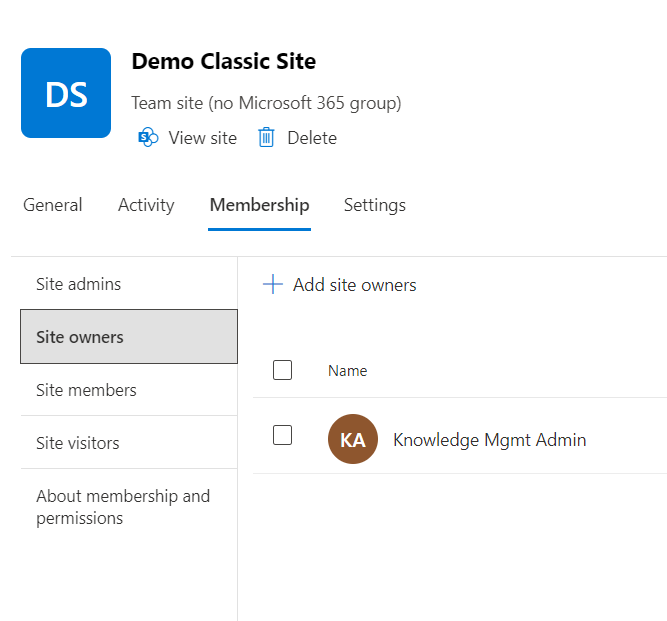
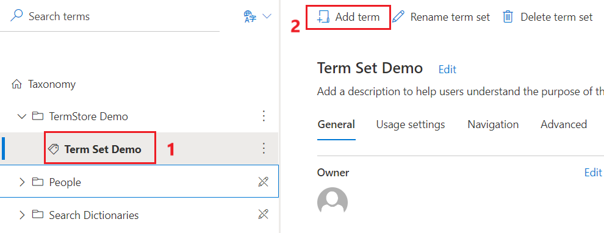

# Lab 3 – Leverage SharePoint for Advanced Knowledge Management

## Objective

This Lab guides you through creation of Sharepoint and performing various actions on the site. In addition, you will also learn about configuring Term store in the Oneline Sharepoint Portal

## Exercise 1 – Understanding SharePoint Site Structure and Navigation

### Task 1 – Create a Team site

1.  Open a browser. Go to [Active
    sites](https://go.microsoft.com/fwlink/?linkid=2185220) in the
    SharePoint admin center

2.  Sign in with the credentials provided to you to execute the labs.

3.  Select **Create**.

4.  Select **Team site** (to create a Microsoft 365 group-connected team
    site), **Communication site**, or **Browse more sites**.

1.  Browse and select a template that says **Standard Template.**

2.  Select **Use template**.

1.  Enter the below details.

    1.  Site name - **Demo**

    2.  Owner – Enter the admin account name that you are using for the
        lab

    3.  Select **Next.**

2.  Select Create Site

3.  Add the owner which the admin account that is assigned to you under
    **Add site owners and members** page. Once that is completed click
    on **Finish**

### Task 2 – Create a Classic site

We recommend using the new site templates for all your new sites.
However, if you need to create a site that uses a classic template, you
can do so using the following steps:

1.  On the active sites page, and select **Create** again.

2.  At the bottom of the panel, select **Browse more sites**.

3.  Under **Choose a template**, select **More templates**.

4.  Enter the below details

    - Site Name – Demo Classic Name

    - Primary Administrator – Add the admin account that you are using
      for the execution of the lab

    - Select **Next**

5.  Select **Create Site**

6.  The site is created successfully.

### Task 3 – Adding members to the created site

1.  Select the URL of the site that you created.

2.  Select the **Membership** tab to add the members.

3.  Add the admin user ID shared with you to execute the labs under Site
    Admins, Site Owners, Site Members and Site visitors.

### Task 4 – Editing the SharePoint site address.

1.  Select the SharePoint classic site that you created.

2.  Select the **Edit** option under **Site address.**

3.  Update the name as **DemoClassic** and select **Save.**

4.  You can select No to update the Site Name.

> 

### Task 5 – Reviewing the SharePoint site actions

1.  Select **Your recent actions** on your **Active Sites** page. The
    recent actions panel appears and lists your most recent 30 actions
    made within the last 30 days.

2.  Select **Export** to download the list as a CSV file.

### Task 6 – Share your site with others

1.  Select the URL of the Classic SharePoint you created.

2.  Select **Settings **and then** Site Permissions**.

3.  Select **Add members** and then select **Add members to group**.

1.  Select **Add members **then enter the name(s) of all users you want
    to grant full access to team site content, shared resources like
    the team Outlook calendar and editing rights to the site. 

2.   Select **Save **when finished adding members and setting
    permissions.

### Task 7 – Managing your Share Point Team site settings

1.  Select **Settings**, and then select **Site information**.

2.  Update the site name and description from **Demo** to **Demo Share
    Point.** Select **Save** to reflect the settings.

3.  Select **Settings**, and then select **Site permissions**.

4.  Select the **down arrow** next to the permission level for the
    member to remove.

## Exercise 2 – Content Management with Term Stores and Content Types

### Task 1 – Managing Terms and Sets within the Term Store

#### Open the Term Store Management Tool

If you're a Global Administrator or SharePoint Administrator in
Microsoft 365, you can access the Term Store Management Tool from the
SharePoint admin center.

1.  While you are on the SharePoint portal. You must Open the SharePoint
    admin center.

2.  In the left navigation, under **Content services**, choose [**Term
    store**](https://go.microsoft.com/fwlink/?linkid=2185073).

#### Set up a new group for term sets

A term group is a set of term sets that all share common security
requirements. Only users who are designated as contributors to a
specific group can manage term sets that belong to the group or create
new term sets within it. Organizations should create unique groups for
term sets that will have unique access or security needs. For
information about how to create a term set, see [Set up a new term
set](https://learn.microsoft.com/en-us/sharepoint/set-up-new-term-set).

** Important**

To create a new term set group, you must be a term store admin.

To set up a new group for term sets, follow these steps.

1.  In the SharePoint admin center, under **Content services**,
    select [**Term
    store**](https://go.microsoft.com/fwlink/?linkid=2185073).

2.  In the right pane, click **Add term group**.

3.  Enter a name for your new group as **TermStore Demo**, and then
    press ENTER.

> 

4.  To edit the Term group **name** and **description**,
    select **Edit** next to the group name.

5.  The **Edit name and description** panel appears. Enter the below
    details

    1.  **Description** – This group is demo group explaining creation
        of Term Store group.

    2.  Select **Save**.

6.  To edit the group managers or contributors, select **Edit** next
    to **Group managers**.

7.  The **Edit admins** panel appears. Update the below details
    accordingly.

    1.  Enter the names or email addresses of the admin account that you
        are using for this lab execution

    2.  Assign them to a manager role

    3.  Click **Save**.

#### Create a Term set

To create a term in a term set

1.  In the SharePoint admin center, under **Content services**,
    select **Term store**.

2.  Select the **TermStore Demo** group, Select **Add term set**

3.  Enter the name as **Term Set Demo.** Press on ENTER.

4.  In the tree-view pane, select on **Term Set Demo** that you just
    created.

5.  Select **Add term**.

6.  Type a name for the term as **Term Demo** and press ENTER.

** Note**

If you don't see **+Add**, that's probably because you have only one
working language, which is your default language. You can add more
working languages by selecting **Taxonomy**, then
selecting **Edit** next to **Default language**

- On the **Usage settings** tab, to make the term available to the users
  and content editors of sites consuming this term set, select **Edit**.
  The **Available for tagging**panel appears. By default, the term is
  enabled for tagging. To disable, select the **Enable** checkbox.
  Select **Save**.

- On the **Advanced** tab, to use shared or local custom properties to
  store more data about term sets, select **Edit**. The **Edit shared
  custom properties** panel appears. Add property names and values.
  Select **Save**.

### Task 2 – Managing the Term set

Navigate to the **Term Set Demo** that you created in the previous Task

#### General tab

1.  On the **General** tab, for **Owner**, select **Edit**. The **Edit
    Properties** panel appears.

2.  Add the admin account under

    - **Term set owner –** The admin account that you are using to
      execute the labs

    - **Stake holder -** The admin account that you are using to execute
      the labs

    - **Contact -** The email ID of the admin account that you are using
      to execute the labs

3.  Click **Save**.

#### Usage settings tab

To configure the term submission policy

1.  On the **Usage settings** tab, for **Submission policy**,
    select **Edit**. The **Edit submission policy** panel appears.

2.  Specify whether you want the term set to be **Closed** or **Open**.
    If you select **Closed**, only people with contribute permissions
    can add terms to this term set. If you select **Open**, users can
    add terms from a tagging application. Select **Open**

3.  Click **Save**.

To configure the tagging policy

1.  Under the **Usage settings** tab, for **Available for tagging**,
    select **Edit**. The **Available for tagging** panel appears.

2.  Select the **Enable** check box to make the terms in the term set
    available for tagging. If you clear the **Enable** check box, this
    term set won't be visible to most users. If the term set is still in
    development, or is not otherwise ready for use, you might want to
    clear the **Enable** check box.

3.  Select **Enable** and Select **Save**.

#### Navigation tab

Enabling site navigation means you can use the terms in this term set
for site navigation links with friendly URLs and dynamic content.
Enabling faceted navigation means users can use refiners based on
managed metadata from the search index to quickly browse to specific
content

1.  Under the **Navigation** tab, for **Use term set for site
    navigation**, select **Edit**.

2.  The **Edit Properties** panel appears. Click the **Enable** check
    boxes to **Use this term set for site navigation**. Click **Save.**

3.  Select **Edit** under **To set a custom target page** and **set a
    custom catalog item page.** Move the toggle switch to enable
    **custom target page** and **Catalog item page**. Select **Save**.

#### Advanced tab

You can use machine translation to translate your terms, or you can
export and import XLIFF files. You must repeat the translation each time
you update the term set.

To configure translations

1.  Under the **Advanced** tab, for **Translation**, select **Manage**.

2.  The **Translation** panel appears. To use machine translation to
    translate this term set into the working languages for the term
    store, select **Start**.

3.  The **Machine translation** panel appears.

    1.  For the terms you want to translate, select **All terms**

    2.  From both the **Translate from** and **Translate to** dropdowns,
        select a language.

    3.  Click **Translate.**

### Task 3 – Creating and Assigning Content Types

#### Assigning Site Collection Administrator Role 

In this task, you assign yourself as a **site collection administrator**
for the Content Type Hub by following the below steps

1.  Open a browser and type in the below URL in the address bar. Replace
    \<tenantname\> with your tenant name that you see when you launch
    the [SharePoint admin
    portal](https://go.microsoft.com/fwlink/?linkid=2185074).

<https://tenantname-admin.sharepoint.com/_layouts/15/online/TA_SiteCollectionOwnersdialog.aspx?site=https://tenantname.sharepoint.com/sites/contentTypeHub>

2.  Enter your admin account accordingly under both **Primary Site
    Collection Administrator** and **Site Collection Administrator.**
    Select **OK**

Note – Once you have added, it takes approximately 15 minutes to reflect
the changes.

#### Create a content type

1.  While you are on the [SharePoint Admin
    Portal](https://go.microsoft.com/fwlink/?linkid=2185074). You are
    already on the Content Type Gallery page. Select **Create content
    type**.

2.  The **Create content type** panel appears. Enter the below details

    - Name – Presentation

    - **Category** - Select **Use an existing category**

    - **Parent content type –** Select **Document Content** **Types**

    - **Content type –** Select **Document**.

3.  Select **Create**.

The new content type appears in the **Content type gallery**.

#### Change the name of a content type

1.  Under the **Site content type** column, select the name of the site
    content type that you just created - **Presentation**

2.  On the content type page, on the menu bar, select **Edit**.

3.  The **Edit content type** panel appears. In the **Name** text box,
    change the name of the content type to **Presentation Demo**

4.  Select **Save**.

#### To associate a template with a content type

1.  While you are on the content type – **Presentation Demo** that you
    just created in the previous task.

2.  In the menu bar, under **Settings**, select **Advanced Settings**.

3.  The **Advanced Settings** panel appears. Update with below details

    - Enter the location of the template, select **Upload a new document
      template**, and then select **Upload**. Select a Sample Bakery
      Invoice Template.

    - Under **Permissions**- Select **Edit**. You can change this
      setting later from this page by anyone with permissions to edit
      this content type.

    - Under **Update site and lists**, Check the box for updating all
      the sites.

    - Select **Save**.

### Summary

Congratulations! You have completed Lab 3 by creating a Sharepoint and performing various actions on the site. In addition, you will also learnt about configuring Term store in the Oneline Sharepoint Portal
