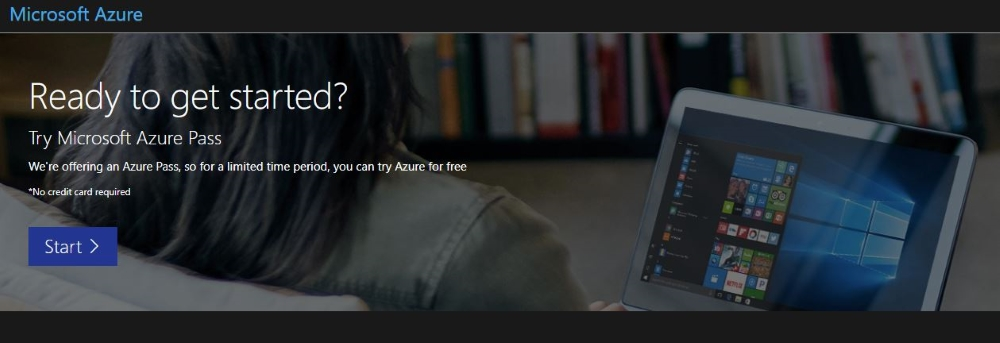
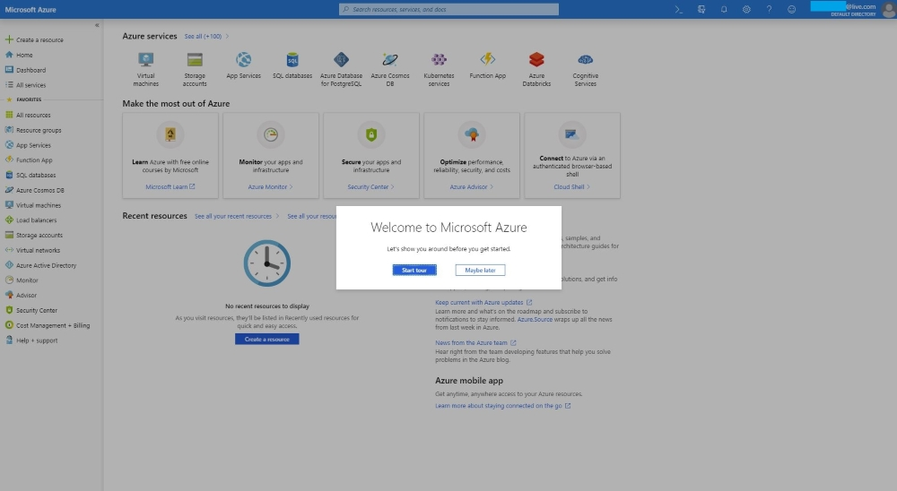
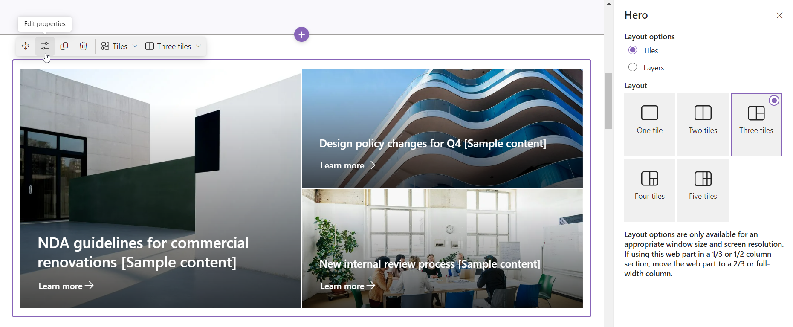

# Lab 4 – Setting Up a SharePoint Contracts Management Site

## Objective

This Lab guides you through configuring Microsoft Syntex and creating Sharepoint Contract Management Site and performing actions on the site via Sharepoint Portal.

## Task 1 - Redeem the Azure Pass Redeeming a Microsoft Azure Pass Promo Code

1.  Open a browser and navigate to: **www.microsoftazurepass.com**. It is recommended you close all browsers and open a new In-Private
Browser session. Other log-ins can persist and cause errors during the
activation step.

2.  Click the **Start** button to get started.

3.  Enter the credentials provided to you to execute the labs

4.  Click **Confirm Microsoft Account** if the correct email address is
    listed.

5.  Enter your **Azure Pass** promo code in the Enter Promo code box and
    click “**Claim Promo Code**”.

6.  It may take up to 5 minutes to process the redemption.

You will be navigated to Azure Portal.

## Task 2 – Setting up Pay as you go billing for Syntex account

1.  Open a browser and launch the [Microsoft Admin
    center](https://admin.microsoft.com/)

2.  Login with the credentials provided to execute the labs

3.  Once you login, select **Setup** from the left navigation pane.

4.  Select **Automate content processes with Syntex**

5.  Select **Go To Syntex settings**

6.  Select Pay-as-you-go billing and update the details and click on
    **Save**.

## Task 3 – Utilizing the Pre-Built Contracts Management Template

1.  Open a browser. Navigate to [Microsoft Admin
    Center](https://admin.microsoft.com/). Sign in with the credentials
    provided to execute the labs.

2.  Select Show all from the left navigation pane.

> 

3.  Select SharePoint under Admin centers.

> 

4.  Select **Sites \> Active Sites**

> 

5.  Select **Create**

6.  Select **Contracts Management.**

7.  Select the **Contracts Management** site template to
    display additional information. Select **Use template**.

8.  Enter the below details

    1.  Sitename – ContractManagement

    2.  Group Owner – Enter your Admin name

9.  Select **Create Site**

10. Select **Finish**

## Task 4 – Review pre-populated site content

Explore pre-populated site content, web parts, and pages and decide what
site customizations will be necessary to align with your organization's
brand, voice, and overall business objective. 

1.  Select the site that you just created in the previous task. Select
    the Site address.

2.  This will take you to the **Contracts Management** site

**Exploring the Pre-populated site pages:**

- **Home page** - Provides and landing place for visitors to review news
  on ongoing crises, response updates, information on policies and
  procedures, and helpful resources.

- **Clients** - This page provides client information in one convenient
  location.

- **Confirmation letters **– Keep track of correspondence that
  formalizes the terms of the agreements between your clients and your
  organization. 

- **Contract templates **– Select the appropriate contract template for
  the type of contract, such as non-disclosure agreements, service
  agreements, and statements of work. 

- **Contract requests **- Use the prebuild list to keep track of
  requested contracts and their status or send a request directly to
  your team. Customize this list template by editing list text fields.

- **Models **- Store a library of models to extract metadata and
  classify information from documents using Microsoft Syntex. Comes with
  two preformatted contract models. 

- **Regions **- Use this prebuilt library to classify contract documents
  by geographical area, country, or region.

- **Service agreements** - Features a prebuild list to help track the
  status of service agreements and provides an overview of contract
  details.

- **Statements of work** - Features a custom preconfigured list to help
  you organize your statements of work in a board view.

- **Recycle bin** - Provides access to recently discarded team content.

## Task 5 – Customize your site

Select the Edit option.

1.  **   Use the Text and Image web parts to provide engaging
    content** - Edit your text and image directly in the web part by
    select them accordingly and updating them accordingly. For Image,
    please select the **Edit properties.** Select **Change** and select
    an image source. Once you've chosen your image,
    select **Insert**.**  **

2.  **Use the Hero web part to highlight important policies, updates,
    and other useful resources**

    1.  Begin by selecting the Hero web part and select **Edit
        properties **(). Then,
        select the **Layer** and **Tile** options that best suit the
        organization’s needs.

3.  **Use the Button web part to help important links stand out on your
    site -** Select the Button web part and choose Edit
    properties (). You can make changes to the
    button label, link, and alignment.

You can republish the changes. Select **Edit** \> **See all the web
parts \>** scroll down through **Documents, lists and libraries \>
Document Library**

4.  **Use the Document library web part to provide quick access to
    contract templates and documents –**

    1.  To change the view, or folder source for the Document library
        web part, select the** Edit properties **().

    2.  To edit document library folders, labels, content, navigate to
        library in **Site content**, make your edits, and then you see
        content update in the web part.

5.  **Use the Site activity web part to stay up to date on team activity
    –** Scroll down to **Data analysis \> Site Activity.** Begin by
    selecting the Site activity web part and select Edit
    properties (). Enter a number in the toolbox
    under Show this many item at a time.

6.  **Use the Quick links web part to provide easy access to resources
    -** Navigate to the Quick Links web part, select the link, and then
    select Edit properties (). Edit the link, title, icon, and
    description if needed. To add a link, select + Add links.

7.  **Use the People web part to list key contacts for the contracts
    management team**

    1.  Start by deleting the placeholder People web part.

    2.  Find the **Toolbox **() on the right. Select **See all web
        parts**, then select or drag-and-drop **People **from the list
        of web parts. 

    3.  Select** Edit properties **().

    4.  Adjust the layout and enter the name of a person or group, then
        select **Save**.

Republish the changes once you have updated.

## Task 6 – Share your site with others

1.  Select **Settings **and then** Site Permissions**.

2.  Select **Add members** and then select **Add members to group**.

3.  Select **Add members **then enter the name(s) of all users you want
    to grant full access to team site content, shared resources like
    the team Outlook calendar and editing rights to the
    site. Select **Save **when finished adding members and setting
    permissions.

1.  Select **Save **when finished adding members and setting
    permissions.

## Task 7 – Maintain your site

After you create and launch your site, the next important phase is
maintaining site content. Ensure you have a plan to keep content and web
parts up to date. 

**Exploring the Site maintenance best practices:**

- **Plan for site maintenance **- Establish a schedule to review the
  site content as often as needed to ensure content is still accurate
  and relevant.

- **Regularly post news** - Distribute the latest announcements,
  information, and status across the organization. You can create a news
  post on a team site or communication site and show others who will be
  posting announcements how they can use SharePoint news.

  1.  From your team site, select **New** \> **News post**

2.  Select the **Blank** template and **Create post**.

3.  Select **Edit Properties**. Update the **title** and **text**
    accordingly. Once it is updated. Select **Post and send**

4.  You can send the post.

- **Check links and web parts **- Keep links and web parts updated to
  ensure you are leveraging the full value of your site.

- **Use analytics to improve engagement **- View site usage by using the
  built-in usage data report to get information on popular content, site
  visits, and more. You can navigate to **Settings \> Site Usage**

- **Periodically review your site settings **- Once you've created a
  site in SharePoint, you can make changes to the settings, site
  information, and permissions for the site from **settings \> Site
  Information**

> 

### Summary

Congratulations! You have completed Lab 4 by configuring Microsoft Syntex and creating Sharepoint Contract Management Site and performing actions on the site via Sharepoint Portal.
