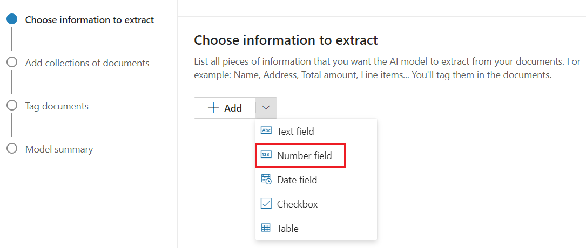

# Lab 5 – Working with Microsoft Syntex for Intelligent Document Processing

## Exercise 1 – Exploring Prebuilt Document Processing Features

### Task 1 – Enable the prebuilt model processing feature to process files

1.  Open a browser and launch the [Microsoft 365 admin
    center](https://admin.microsoft.com/), login with the credentials
    provided to execute the lab

2.  Select **Setup** from the left navigation pane.

3.  Under **Files and content**, select **Automate content processes
    with Syntex**.

4.  On the **Automate content processes with Syntex** page, select **Go
    to Syntex settings**.

5.  On the Syntex page, in the **Document & image services** section,
    select **Prebuilt document processing**.

6.  On the **Sites** tab, Select **All Sites** under **Sites where
    Models can be used**

7.  Select **Save.**

8.  Close the window.

### Task 2 – Create a Content Center

1.  Switch back to **Microsoft Admin Center** home page, Select
    **SharePoint** under **Admin Centers** on the left navigation pane.

2.  Under **Active Center**, Select **Create**

3.  Select **Content Center**

4.  Enter the below details

    1.  **Site Name** – HR content center

    2.  **Primary Administrator**- Enter the admin name that you use to
        execute the labs

    3.  Select **Next**

5.  Select **Create Site.**

6.  You’ll be navigated to the SharePoint **HR Content Center** home
    page. Click **+New** and click **Document library**.

7.  On **Create document library** pane, enter **Invoice** for **Name**
    and click **Create**.

8.  Click **Models** tab. Click **Create a model** on the top left of HR
    Content Center page.

9.  Click **Invoice processing** on **Options for model creation** pane.

10. Click **Next** on **Invoice processing: Details** pane.

11. On **Create an invoice processing model** pane, enter **Office
    Expenses** for **Name** and click **Create**.

### Task 3: Upload an example file to analyze

1.  Click **Add a file** under **Add a file to analyze** on **Model\>
    Office expenses** page.

2.  Click **+Add** on **Files to analyze with the model** pane.

3.  Click **Upload** and then click **Files** on **Add a file from the
    training files library** dialog.

4.  Go to **C:\Labfiles** and select **sample-invoice** then click
    **Open**. Click check box next to **sample-invoice.pdf** on **Add a
    file from the training files library** pane and click **Add**. ­­­

5.  Click **Next** on **Files to analyze with the model** pane.

Stay on the same page for next exercise.

### Task 4: Select extractors for your model

1.  On **View extractor details** page, on **Invoice extractors** pane,
    click check box next to **AmountDue** and click **Yes** on **Select
    extractor?** dialog.

2.  Click the check box for **BillingAddress** on **Invoice extractors**
    pane and click **Yes** on **Select extractor?** dialog.

3.  **Scroll down** on **Invoice extractors** pane and in the same way
    click the check box for **CustomerId, CustomerName, DueDate,
    InvoiceDate, InvoiceID, InvoiceTotal, PreviousUnpaidBalance** and
    **PurchaseOrder** and click **Yes** on **Select extractor?** dialog,
    if prompted.

Stay on the same page for next exercise.

### Task 5: Rename an extractor

1.  On **Invoice extractors** pane, click the check box for
    **AmountDue** and click **Rename**.

2.  On **Rename extractor** dialog, enter **Amount to be paid** and
    click **Rename**.

3.  **AmountDue** is renamed as **Amount to be paid** on **Invoice
    extractors** pane. Click **Next** on **View extractor details**
    page.

Stay on the same page for the next exercise.

Task 6: Apply the model

1.  Click **Apply model** and on **Apply Office expenses to library**
    pane, click **HR Content Center.**

2.  Click **Invoice** on **Apply Office expenses to library** pane under
    **Choose the library you would like to add** **this model to**
    section. Once Invoice is selected, click **Add**.

> 
>
> 

3.  On **Apply Office expenses to library** pane, click **Go to
    library**.

4.  In **Invoice** document Library, click **Upload** and then click
    **Files**.

5.  Go to **C:\Labfile**s and click **invoice-sample** then click
    **Open**. ­­­

6.  Once the processing is complete, the columns will be filled. You
    might have to refresh the page to see the changes after uploading
    the file.

## Exercise 2 - Manage contracts using a Microsoft 365 solution

#### Task 1: Overview of the process

Unstructured document processing models uses artificial intelligence
(AI) to automate classification of files and extraction of information.
These types of models are also optimal in extracting information from
unstructured and semi-structured documents where the information you
need isn't contained in tables or forms, such as contracts.

Unstructured document processing models use optical character
recognition (OCR) technology to scan PDFs, images, and TIFF files, both
when you train a model with example files and when you run the model
against files in a document library.

First, you need to find at least five example files that you can use to
"train" the model to search for characteristics that are specific to the
content type you're trying to identify (a contract).

Using Syntex, create a new unstructured document processing model. Using
your example files, you need to create a classifier. By training the
classifier with your example files, you teach it to search for
characteristics that are specific to what you would see in your
company's contracts. For example, create an "explanation" that searches
for specific strings that are in your contracts, such as Service
Agreement, Terms of Agreement, and Compensation. You can even train your
explanation to look for these strings in specific sections of the
document or located next to other strings. When you think you have
trained your classifier with the information it needs, you can test your
model on a sample set of example files to see how efficient it is. After
testing, if needed you can choose to make changes to your explanations
to make them more efficient.

In your model, you can create an extractor to pull out specific pieces
of data from each contract. For example, for each contract, the
information you're most concerned about is who the client is, the name
of the contractor, and the total cost.

After you successfully create your model, [apply it to a SharePoint
document
library](https://learn.microsoft.com/en-gb/microsoft-365/syntex/apply-a-model?view=o365-worldwide).
As you upload documents to the document library, your unstructured
document processing model will run and will identify and classify all
files that match the contracts content type you defined in your model.
All files that are classified as contracts will display in a custom
library view. The files will also display the values from each contract
that you defined in your extractor.

If you have retention or security requirements for your contracts, you
can also use your model to apply a [retention
label](https://learn.microsoft.com/en-gb/microsoft-365/syntex/apply-a-retention-label-to-a-model?view=o365-worldwide) or
a [sensitivity
label](https://learn.microsoft.com/en-gb/microsoft-365/syntex/apply-a-sensitivity-label-to-a-model?view=o365-worldwide) that
will prevent your contracts from being deleted for a specified period of
time or to restrict who can access the contracts.

#### Task 2: Create a Contract model

The first step is to create your Contract model.

1.  Go to [Microsoft Admin center](https://admin.microsoft.com/) and
    login with the credentials if you have close the window and under
    **Admin center** select **SharePoint** on the left navigation pane.

2.  Go to **Active sites** \> **Create** \> **Syntex Content center**.

3.  Fill in the following details and select **Finish**.

    1.  **Site Name**: **Contract Management Solutions**

    2.  **Primary administrator:** The Admin name that is provided to
        execute the labs

    3.  Select **Next**

4.  Select **Create Site.**

5.  You will be navigated to the newly created site home page.

6.  From the content center, select **New** \> **Model**.

7.  Select the model named **Teaching method**.

8.  Select **Next** on the **Details** page.

9.  On the **Create a model with the teaching method** pane, in
    the **Name** field, type the name of the model. For this contract
    management solution, you can name the model ***Contract***. Choose
    **Create**.

10. On the **Contract Management Solution** home page, you will be able
    to see the model named **Contract.classifier**.

11. This will take you to the home page for the model.

12. Close the training **Pop-up**. Stay on the same page and continue to
    the next task.

#### Task 3: Train your model to classify a type of file

##### Add example files for your model

You need to add at least five example files that are contract documents,
and one example file that's not a contract document (for example, a
statement of work).

1.  On the **Models \> Contract** page, select **Add files**.

2.  On the **Select example files for your model** page, select Upload
    \> Files, go to **C:\Labfiles** and select all the files. Choose
    Upload.

3.  You will be able to see the uploaded files in the Pop-up.

4.  On the Model homepage, click on **Add from Library**.

5.  Select all the files and click on **Add**.

6.  You will see the files listed on the model homepage.

##### Label the files as positive or negative examples

1.  On the **Models \> Contract** page, select **Train classifier**.

2.  On the **Models \> Contract \> Contract classifier** page, in the
    viewer on the top of the first example file, you'll see text asking
    if the file is an example of the Contract model you created. If it
    is a positive example, select **Yes**. If it is a negative example,
    select **No**. Label all the docx files with yes and all the pdfs
    with no.

3.  In the **Labeled examples** list on the left, you will be able to
    see them labeled as either Positive or Negative.

##### Add at least one explanation to train the classifier

1.  On the **Models \> Contract \> Contract classifier** page, select
    the **Train** tab.

2.  In the **Trained files** section, you'll see a list of the example
    files that you previously labeled. Select one of the positive files
    from the list to display it in the viewer.

3.  In the **Explanations** section, select **New** and then **Blank**.

4.  On the **Create an explanation** page:

    1.  In the **Name** field, type the name of the explanation
        **Agreement**.

    2.  In the **Explanation type** field, select **Phrase list**,
        because you add a text string.

    3.  In the **Phrase list** box, type the string **THIS CONSULTING
        AGREEMENT**.

    4.  Select **Save and train**.

5.  You will see the files labeled as Matched or Mismatched after the
    model is trained.

##### Test your model

You can test your Contract model on example files that have not been
used before. This is optional, but it can be a useful best practice.

1.  On the **Models \> Contract \> Contract classifier** page, select
    the **Test** tab. This runs the model on your unlabeled example
    files.

2.  In the **Test Files** list, your example files display and shows if
    the model predicted them to be positive or negative. Use this
    information to help determine the effectiveness of your classifier
    in identifying your documents.

> 

3.  When done, select **Exit Training**.

#### Task 4: Create and train an extractor

##### Create an extractor

1.  On the **Models \> Contract** page, under **Key
    actions** \> **Create and train extractors**, select **Create
    extractor**.

2.  On the **New entity extractor** panel, in the **New name** field,
    type **Client** as the name of your extractor. When you're done,
    select **Create**.

##### Label the entity you want to extract

1.  When you create the extractor, the extractor page opens. Here you
    see a list of your sample files, with the first file on the list
    displayed in the viewer.

2.  From the viewer, select the *Client*, and highlight the client value
    in the first file (in this example, ***Best For You Organics***),
    and then select **Save**. You'll see the value display from the file
    in the **Labeled examples** list, under the **Label** column.

3.  Select **Next file** to autosave and open the next file in the list
    in the viewer. Or select **Save**, and then select another file from
    the **Labeled examples** list.

4.  In the viewer, repeat steps 1 and 2, then repeat until you saved the
    label in 4 of the files.

5.  Mark one pdf file with a No label mark.

##### Add an explanation

You can create an explanation that provides a hint about the entity
format itself and variations it might have in the example files. To help
identify the *Contract Start Date*, you can create an explanation.

1.  In the **Explanations** section, select **New** and then **Blank**.

2.  On the **Create an explanation** page:

&nbsp;

1)  In the **Name** field, type the name of the explanation as **Client
    Name Start.**

2)  In the **Explanation type** field, select **Phrase list**.

3)  In the **Value** field type **BETWEEN:**.

4)  Select **Save and train**.

3.  Create another blank **Explanation**.

4.  On the **Create an explanation** page:

&nbsp;

5)  In the **Name** field, type the name of the explanation as **Client
    Name End**.

6)  In the **Explanation type** field, select **Phrase list**.

7)  In the **Value** field type **OF**.

8)  Select **Save and train**.

5.  You can see the status of Evaluation as **Match**.

##### Test your model again

You can test your Contract model on example files it hasn’t seen before.
This is optional, but it can be a useful best practice.

1.  On the **Models \> Contract \> Contract classifier** page, select
    the **Test** tab. This runs the model on your unlabeled example
    files.

2.  In the **Test files** list, your example files display and shows if
    the model is able to extract the information you need. Use this
    information to help determine the effectiveness of your classifier
    in identifying your documents.

3.  When done, select **Exit Training**.

##### Create a Contract Date Extractor

1.  Repeat the steps to create a **Date extractor** with the following
    information and then label the extractor: Name: **Contract Date**

2.  Go to **Train** tab, where you can create an explanation that
    provides a hint about the date value which can be in many different
    formats. To help identify the *Contract Start Date*, you can create
    an explanation.

3.  In the **Explanations** section, select **New** and then **Blank**.

4.  On the **Create an explanation** page:

    1.  In the **Name** field, type the name of the explanation as
        **Date**.

    2.  In the **Explanation type** field, select **Phrase list**.

    3.  In the **Value** field select Add a list of phrases from a
        template, select Date and choose Add.

    4.  Select **Save and train**.

5.  On the **Create an explanation** page:

    1.  In the **Name** field, type the name of the explanation as
        **Date start**

    2.  In the **Explanation type** field, select **Phrase list**.

    3.  In the **Value** field type **dated**.

    4.  Select **Save and train**.

6.  Go to the **Test** tab, test and exit the page.

#### Task 5: Apply your model to a document library

To apply your model to a SharePoint document library:

1.  On the **Models \> Contract** page, under **Key actions** \> **Apply
    model to libraries**, select **Apply model**.

2.  On the **Add Contract** panel, select the SharePoint site that
    contains the document library that you want to apply the model to.
    If the site does not show in the list, use the search box to find
    it. Select **Add**. Here we will select our Content Center -
    **Contract Management Solutions**.

3.  After you select the site, select the document library to which you
    want to apply the model. Here we will select the folder named
    **Files**.

4.  Select **Add** to apply the model to the library.

5.  On the **Models \> Contract** page, in the ‘**Libraries with this
    model’** section, you'll see the URL to the SharePoint site listed.

6.  Select **Go To Library**

7.  Scroll to the end of the columns by moving the horizontal bar:

    1.  Click **Add column** and then click **Choice.** Select **Next**

2.  On **Create a column** pane, for **Name** type **Approval Status**,
    and for values enter **In review**, **Approved**, and **Rejected**
    under Choice 1, Choice 2 and Choice 3. Select **Save.**

> 

8.  After you apply the model to the document library, you can begin
    uploading documents to the site and see the results. For now we will
    upload the same files to this site that we used for training. You
    can use any other contract files, similar to the one used for
    training

9.  Select **Upload \> Files** from the top bar and select the files
    from **C:\Labfiles.**

10. Now, click **Add Column** and select **Show or hide columns**.

11. Select the check boxes near **Client**, **Contract Date**, and
    **Approval status**. Click **Apply**.

12. You will be able to see all the information that the model
    extracted, listed in the directory.

13. Now select a file and choose three dots and select **More** \>
    **Properties**.

14. In the document properties pane under **Approval Status**, select
    one status.

15. Repeat and add **Approval Status** to all the files.

#### Task 6: Use Microsoft Teams to create your contract management channel

When your organization sets up a contracts management solution, you need
a central location in which stakeholders can review and manage
contracts. For this purpose, you can use Microsoft Teams to set up a
Teams channel and use the features in Teams to:

- **Create a location for stakeholders to easily see all contracts that
  require action.** For example, in Teams you can create
  a **Contracts** tab in the Contract Management channel in which
  members can see a useful tile view of all contracts that need
  approval. You can also configure the view so that each "card" lists
  the important data you care about (such as *Client*, *Contractor*,
  and *Fee amount*).

> 

- **Have a location for members to interact with each other and see
  important events.** For example, in Teams, the **Posts** tab can be
  used to have conversations, get updates, and see actions (such as a
  member rejecting a contract). When something has happened (such as a
  new contract submitted for approval), the **Posts** tab can be used
  not only to announce it, but also to keep a record of it. And if
  members subscribe to notifications, they'll get notified whenever
  there's an update.

> 

- **Have a location for members to see approved contracts to know when
  they can be submitted for payment.** In SharePoint, you'll need to
  create a **For Payout** list and include columns
  for **Client**, **Contractor**, and **Fee amount**, selecting **Single
  line of text** as the column type. You'll need to add the **For
  Payout** list as a Teams tab in the Contract Management channel,
  similar to [*what you'll do for
  the* **Contracts** *tab*](https://learn.microsoft.com/en-gb/microsoft-365/syntex/solution-manage-contracts-step2?view=o365-worldwide#attach-your-sharepoint-document-library-to-the-contracts-tab).
  The **For Payout** tab will list all contracts that will need to be
  submitted for payment. You can easily extend this solution to instead
  write this information directly to a third-party financial application
  (for example, Dynamics CRM).

##### Attach your SharePoint document library to the Contracts tab

1.  Open another tab and launch the
    [Teams](https://teams.microsoft.com/) application. Click three dots
    on **Contoso** and select **+**.

2.  Then search for SharePoint and select accordingly.

3.  Select **Any SharePoint site**. Paste the link to the **Contracts
    Management Solutions** \> **Files** and click **Save**.

4.  Click the newly added **Files** dropdown icon and select **Rename**.

5.  On **Rename Files** dialog enter **Contracts** for tab name and
    click **Save.**

6.  Continue to the next task.

##### Customize your Contracts tab tile view

While Teams lets you view your contracts in a tile view, you might want
to customize it to view the contract data you want to make visible in
the contract card. For example, for the **Contracts** tab, it is
important for members to see the client, contractor, and fee amount on
the contract card. All of these fields were extracted from each contract
through your Syntex model that was applied to your document library. You
also want to be able to change the tile header bar to different colors
for each status so that members can easily see where the contract is in
the approval process. For example, all approved contracts will have a
blue header bar.

> 

Let us change the view of the files.

The custom tile view you use requires you to make changes to the JSON
file used to format the current tile view. You can reference the JSON
file used to create the card view by looking at
the [*ContractTileFormatting.json*](https://github.com/pnp/syntex-samples/blob/main/scenario-samples/Contracts-Management/View%20Formatter/ContractTileFormatting.json) file.
In the following sections, you'll see specific sections of the code for
features that are in the contract cards.

> 

1.  Click on **All Documents**, Select **Contract**.

> 

2.  Select the **Tiles** view and select **Format Current View**.

> 

3.  In the **Format View** tab.

> 

4.  Go to
    **https://github.com/pnp/syntex-samples/blob/main/scenario-samples/Contracts-Management/View%20Formatter/ContractTileFormatting.json**
    and copy the code to the box given.

> 

5.  Review the following code that we used to modify the view.

- Card size and shape

In
the [*ContractTileFormatting.json*](https://github.com/pnp/syntex-samples/blob/main/scenario-samples/Contracts-Management/View%20Formatter/ContractTileFormatting.json) file,
look at the following section to see the code for how the size and shape
of the card is formatted.

{

"elmType": "div",

"style": {

"background-color": "#f5f5f5",

"padding": "5px",

"width": "180px"

},

"children": \[

{

"elmType": "img",

"attributes": {

"src": "@thumbnail.large"

},

"style": {

"width": "185px",

"height": "248px"

}

}

- Contract status

The following code lets you define the status of each title card. Note
that each status value (*New*, *In review*, *Approved*, and *Rejected*)
will display a different color code for each. In
the ContractTileFormatting.json file, look at the section that defines
the status.

{

"elmType": "div",

"children": \[

{

"elmType": "div",

"style": {

"color": "white",

"background-color": "=if(\[$Status\] == 'New', '#00b7c3', if(\[$Status\]
== 'In review', '#ffaa44', if(\[$Status\] == 'Approved', '#0078d4',
if(\[$Status\] == 'Rejected', '#d13438', '#8378de'))))",

"padding": "5px 15px",

"height": "auto",

"text-transform": "uppercase",

"font-size": "12.5px"

},

"txtContent": "\[$Status\]"

}

- Extracted fields

Each contract card will display three fields that were extracted for
each contract (*Client*, *Contractor*, and *Fee Amount*). Additionally,
you also want to display the time/date that the file was classified by
the Syntex model used to identify it.

In the ContractTileFormatting.json file, the following sections define
each of these.

**Client**

This section defines how "Client" will display on the card, and uses the
value for the specific contract.

{

"elmType": "div",

"style": {

"color": "#767676",

"font-size": "12px"

},

"txtContent": "Client"

},

{

"elmType": "div",

"style": {

"margin-bottom": "12px",

"font-size": "16px",

"font-weight": "600"

},

"txtContent": "\[$Client\]"

},

**Contractor**

This section defines how the "Contractor" will display on the card, and
uses the value for the specific contract.

{

"elmType": "div",

"txtContent": "Contractor",

"style": {

"color": "#767676",

"font-size": "12px",

"margin-bottom": "2px"

}

},

{

"elmType": "div",

"style": {

"margin-bottom": "12px",

"font-size": "14px"

},

"txtContent": "\[$Contractor\]"

},

**Fee amount**

This section defines how the "Fee Amount" will display on the card, and
uses the value for the specific contract.

{

"elmType": "div",

"txtContent": "Fee amount",

"style": {

"color": "#767676",

"font-size": "12px",

"margin-bottom": "2px"

}

},

{

"elmType": "div",

"style": {

"margin-bottom": "12px",

"font-size": "14px"

},

"txtContent": "\[$FeeAmount\]"

},

**Classification date**

This section defines how "Classification" will display on the card, and
uses the value for the specific contract.

{

"elmType": "div",

"txtContent": "Classified",

"style": {

"color": "#767676",

"font-size": "12px",

"margin-bottom": "2px"

}

},

{

"elmType": "div",

"style": {

"margin-bottom": "12px",

"font-size": "14px"

},

"txtContent": "\[$PrimeLastClassified\]"

}

6.  If after the exercise you do not see the values or status, check the
    references to sharepoint columns in json files and update them. The
    steps to do this are as follows.

7.  Go to the **Contract Management Solution** \> **File**.

8.  Sort the files by the ‘**Approval Status**’ column.

9.  In the addressbar check the **URL**. You will find the internal name
    of your field after the ‘Field’. For example here it is
    [https://m365x91851961.sharepoint.com/sites/ContractManagementSolutions/Prime/Forms/AllItems.aspx?isAscending=true&sort**Field=ApprovalStatus**&viewid=f0b6d5f9%2D69f2%2D424a%2Da407%2D01f08d516af6](https://m365x91851961.sharepoint.com/sites/ContractManagementSolutions/Prime/Forms/AllItems.aspx?isAscending=true&sortField=ApprovalStatus&viewid=f0b6d5f9%2D69f2%2D424a%2Da407%2D01f08d516af6)

10. Copy the name of the field and update the name of those fields in
    Json. Here we will replace **\[$Status\]** with
    **\[$ApprovalStatus\]** in teams json.

11. Click **Save**. You will now be able to see the status of each file
    in teams.

Congratulations, now you can create an extractor for all the necessary
information to manage contracts and display that information in teams.

## Exercise 3 – Exploring Structured & Freeform Document Processing Features

### Task 1: Enable Power Pages Free Trial.

1.  Open a new tab and launch the [Power Pages
    trial](https://powerpages.microsoft.com/) . Login with the
    credentials provided to execute the lab. Select **Try it for free**.

2.  Enter the credentials provided to you to execute the lab.

3.  Enter your country/region and phone number.  A new Microsoft Power
    Platform trial environment will be created for you.

### Task 2 - **Set up structured and freeform document processing**

1.  In the Microsoft 365 admin center,
    select [**Setup**](https://go.microsoft.com/fwlink/p/?linkid=2171997).

2.  Under **Files and content**, select **Automate content processes
    with Syntex**.

3.  On the **Automate content processes with Syntex** page, select **Go
    to Syntex settings**.

4.  On the Syntex page, in the **Document & image services** section,
    select **Structured and freeform document processing**.

5.  Under **Settings** make sure the status is **ON** and click on
    **Edit** under Power Platform environment – Select **custom
    environment** and select your **power pages** environment

6.  Select **Sites** tab, choose the site or sites on which this service
    should be enabled. Select **All.**

7.  Select **Save.**

### Task 3 - Install **AI Builder for Project Cortex** app

1.  Open a new tab and launch the [Power Platform Admin
    center](https://admin.powerplatform.microsoft.com/)

2.  Login with the credentials provided to you to execute the lab.

3.  Select **Environments** on the left navigation pane. The power pages
    environment that got just created.

4.  Select **Resources \>** **Dynamics 365 Apps.**

5.  Search for **AI Builder for Project Cortex app.** Select
    **Install.**

6.  Update the details as below

    1.  Select an Environment – Power Pages trial environment

    2.  Check the box agreeing the terms of service

    3.  Select **Install**

7.  Select the environment from left navigation pane. Select the **power
    pages environment \> Resources \> Dynamics 365 apps**. The app is
    installed.

### Task 4: Create, Train and Test a form processing model 

1.  Switch back to [Microsoft Admin
    center](https://admin.microsoft.com/) if it already open else you
    can open a new tab and launch. Sign with the credentials.

2.  Select **SharePoint** under **Admin centers** from left navigation
    menu.

3.  You will be navigated to **SharePoint admin center**, click **Active
    sites** from left navigation menu. On **Active Sites** page, click
    **HR Content Center** and click **URL** on **HR Content Center**
    pane.

4.  You’ll be navigated to the SharePoint **HR Content Center** site on
    another tab. Click **Site contents** and click **+New** then click
    **Document Library**.

5.  On **Create document library** pane, enter **Purchase Orders** for
    **Name**.

6.  Click **Purchase Orders** and click **Upload\>Files**.

7.  Go to **C:\Labfiles** and select all the files then click **Open**.

8.  Select **Models\> Create a Model.**

9.  Click **Freeform selection method** on **Options for model
    creation** pane.

10. Click **Next** on **Freeform selection method:Details** pane.

11. Enter **Purchase Order** for **Name** and click **Create** on
    **Create a model with the freeform selection method** pane.

12. Click **Add** on **Choose information to extract** pane and click
    **Number Field** on **Add** pane then click **Next.**

13. On **Number** **Field** dialog, enter **PO-number** for **Name** and
    click **Done**.

14. Click **Add** on **Choose information to extract** pane and click
    **Text** **Field** on **Add** pane then click **Next.** On **Field**
    dialog, enter **Vendor Name** for **Name** and click **Done**.

15. Click **Add** on **Choose information to extract** pane and click
    **Number Field** on **Add** pane then click **Next.** On **Field**
    dialog, enter **PO-Total** for **Name** and click **Done**.

16. Click **Next** on **Choose information to extract** pane.

17. Click **New collection** on **Add collections of documents** pane.

18. Click **+**icon on **Collection 1** box under **Add documents**.

19. Click **Add documents** on **Collection 1** pane.

20. Click **My device** on **Select source** pane.

21. Go to **C:\Labfiles** and select all the 7 PDF files and click
    **Open**.

22. Click **Upload 7 documents** on **Upload documents** pane.

23. Click **Done** on **Upload documents** pane, once it notifies that
    **Successfully uploaded 7 of 7 documents**.

24. Click **Next** on **Create a collection for each similar documents**
    pane.

25. Click **document 1** and place the cursor in **PO \#** box and
    select PO then click **PO-number.** Place the cursor under
    **Vendor** and select **Pradeep Gupta** then click **Vendor Name**.
    Scroll down and place the cursor on **Total amount** box and select
    the amount and click **PO-Total.**

26. On **Collection 1** pane on right, the fields will have green checks
    as you have selected **PO-number, Vendor Name** and **Po-Total**.

27. Click **document 2.** Place the cursor on **PO#** box and select PO
    then click **PO-number**. Place the cursor on **Pradeep Gupta**
    under **Vendor** and click **Vendor Name** then place the cursor on
    **Total amount** and click **PO-Total**. Click **document 3**.
    Repeat the same steps for document 3, 4 and 5. Make sure all the
    first five documents are **Purchase Order** documents.

28. Click **document 6** and place the cursor in **TRADE#** box and
    select TRADE number then click **PO-number**. Click three dots on
    **Vendor Name** and **PO-Total** and click **Not available in
    document**. Click document 7 and place the cursor in **TRADE#** box
    and select the TRADE number and click **PO-number** then click three
    dots on **Vendor Name** and **PO-Total** and select **Not available
    for document**. The check box for Vendor Name and PO-Total for
    document 6 and 7 will be greyed out. Click **Next.**

29. Click **Train** on **Model summary** page.

30. Click **Go to models** on **Your model is training** pane.

*Note: It may take some time for training to complete. To save time, you
may carry on with lab 3 and 4 then you can return to lab 2.*

Task 5: Apply a form processing model to a library

1.  Click **Publish** on **Training document** section.

2.  Click **HR Content Center** on **Apply Purchase Order** pane.

3.  Click **Purchase Orders** and click **Add** on **Apply Purchase
    Order** pane.

4.  Click **Go to library**.

5.  You will be navigated to **HR Content Center**. Click the check box
    next to **Name** and click **Delete** on **Purchase Orders** pane.
    Click **Delete** on **Delete?** dialog box.

6.  Click **Upload\>files** and go to **C:\Labfiles** and select all the
    PDF files and click **Open**.

7.  All the columns will be visible once analyzing is complete. It may
    take some time for columns to be filled with data.

Congratulations! You have successfully created a form processing model
and applied it to a library.

## Exercise 4 – Exploring Unstructured Document Processing Features

### Task 1: Create a Teaching method custom model 

1.  On the Lab VM, open a new browser tab and sign in to
    ***<https://admin.microsoft.com/>*** . Login with the credentials
    provided to you to execute the lab

2.  On **Enter Password** prompt, enter the password for the tenant
    provided to you for the lab and click **Sign in**.

3.  On **Stay signed in** prompt, click **No**.

4.  In **Microsoft 365 admin center**, click **SharePoint** under
    **Admin centers** from left navigation menu.

5.  On **Pick an account** prompt, select the tenant id provided to you
    for the lab. In **SharePoint admin center**, click **Active sites**
    from left navigation menu. On **Active Sites** page, click **HR
    Content Center** and click **URL** on **HR Content Center** pane.

6.  You’ll be navigated to the SharePoint **HR Content Center** site on
    another tab. Click **Models**.

7.  Click **Create a model** on the top left of HR Content Center page.

8.  Click **Teaching method** under **Train a custom model** on
    **Options for model creation** pane.

9.  On **Teaching method: Details** pane, click **Next**.

10. On **Create a model with the teaching method** pane, enter the
    following:

- **Model name**- Enter **Benefit change letter**

- Click dropdown icon for **Advanced settings** and select **Associated
  Content type, create a new content type**.

11. You will be navigated to **Models\>Benefit Change Letter** page.

### Task 2: Train a document understanding model

#### Step 1: Classify files as Negative or Positive

1.  On **Models\> Benefit change letter** pane, click **Add files** in
    **Add example files** section.

2.  On **Select example files for your model** pane, click **Upload**
    and click **Files** under **Training Files** section.

3.  Go to **C:\\ Labfiles** and select all the files then click
    **Open**. ­­­

4.  On **Select example files for your model** pane, click check box
    next to newly added files only and click **Add**.

5.  You will be navigated back to **Models\>Benefit change letter**
    pane, click **Train classifier** under **Classify files and run
    training** section.

6.  Select the first file and click **Yes**. The first file will be
    labeled as **Positive.** Select the second file and click **Yes**.
    Repeat the same steps and click **Yes** for the first six files.

7.  First six files will be labeled as **Positive**. Select **Contoso
    \_SOW_CSI.docx** and **Contoso_SWO_CSI_1.docx** and click **No** for
    both files. Both files will be labeled as **Negative.**

Stay on the same page for next task.

#### Step 2: Create an explanation

1.  Click **Train** next to **Label**. Click **New** and **Blank** on
    **Explanations** dialog box.

2.  On **Create an explanation** pane, click **Save** after entering the
    following:

- **Name-** Enter **Subject**

- **Explanation type**- **Phrase list**

- **Type here** box- Enter **Benefit Change Notice**

Stay on the same page for next task.

#### Step 3: Create an extractor

1.  Click **Benefit change letter** on the top to return to **Benefit
    change letter** pane.

2.  Click **Create extractor** under **Create and train extractors**.

3.  **New entity extractor** pane will open on the right. On **New
    entity extractor** pane, enter **Provider** for **Name** and click
    **Create**.

4.  **Provider Extractor** page will open. For first file, select
    **Contoso Pharmaceuticals** using cursor and click **Next file**.

5.  On **Provider Extractor** page for second file, select **Adventure
    Works Cycles** using cursor and click **Next file**.

6.  On **Provider Extractor** page for third file, select **Alpine Ski
    House** using cursor and click **Next file**.

7.  On **Provider Extractor** page for fourth file, select **Bellows
    College** using cursor and click **Next file**.

8.  On **Provider Extractor** page for fifth file, select **Best For You
    Organics Company** using cursor and click **Next file**.

9.  On **Provider Extractor** page for sixth file, select **Contoso,
    Ltd.** using cursor and click **Next file**.

10. On **Provider Extractor** page for **Contoso_SOW_CSI.docx** and
    click the check box for **No label**. Click **Next file**.

11. On **Provider Extractor** page for **Contoso_SOW_CSI_1.docx** and
    click the check box for **No label**. Click **Save.**

Stay on the same page for next task.

#### Step 4: Add an explanation

1.  Click **Train** next to **Label**. Click **New** and **Blank** on
    **Explanations** dialog box.

2.  On **Create an explanation** pane, enter the following:

- **Name-** Enter **Provider**

- **Explanation type**- **Phrase list**

- **Type here** box- Enter **your insurance provider**

- Click **Save and train.**

3.  Under **Trained files- Remove**, on **Evaluation** tab, you will see
    **Match** or **Mismatch** for the files.

4.  Click **New** and then click **Blank.**

5.  On **Create an explanation** pane, enter the following:

- **Name**- Enter **Text after**

- **Explanation type**- **Phrase list**

- **Type here** box- Enter **(http://**

- Click **Save and train.**

6.  The **Execution** tab will now show **Match** for all the files.

#### Step 5: Apply a model to a SharePoint library

1.  Go back to Benefit Change letter. Click **Apply model** under
    **Apply model to libraries**.

2.  On **Apply Benefit change letter** pane, click **HR Content Center**
    under **Frequent sites.**

7.  Click **Files** below **HR Content Center** and click **Add** on
    **Apply Benefit change letter** pane.

8.  Click **Go to library** on **Apply Benefit change letter** pane.

9.  Select **Go to Library**. Click **Upload** and click **Files**.
    **Benefit change letter** model will be visible in the upper right
    navigation pane.

10. Go to **C:\Labfiles** and select all the files then click **Open**. ­­­

11. Once processing is complete the files will be visible.

12. Click **Files** tab, column named **Model URL** and **Confidence
    Score** will be visible.

Congratulations! You've created a
document understanding model that classifies files and extracts data.
You've also applied that model to a document library and had each file
analyzed.

## Exercise 5 – Implementing Taxonomy Tagging for Improved Organization

Task 1 - **Create a new taxonomy column**

1.  Open a browser tab and paste the [Microsoft Admin
    Center](https://admin.microsoft.com/)

2.  Login with the admin credentials provided to execute the lab.

3.  Select **Show All** on the left navigation pane. Select
    **SharePoint** under **Admin centers**

> 

4.  Select the URL to launch the site of **Demo Classic Site** that you
    created under **Active Sites**.

5.  Select **Documents** from the left navigation pane, select **Add a
    column**.

6.  Select **Managed metadata**, and then select **Next**.

7.  On the **Create a column** panel, name the column and select a term
    set or term, and then select **Save**.

    1.  **Name** – Demo Column

    2.  **Type** – Managed Meta Data

    3.  **Term set or term** – People \> Department

    4.  **Automatically tag documents with terms –** Yes

8.  Once enabled, any new documents uploaded to the library or existing
    documents edited in the library are processed to tag the configured
    term set.

## Exercise 6 – Leveraging Enhanced Image Tagging for Visual Content Management

1.  Open a browser tab and paste the [Microsoft Admin
    Center](https://admin.microsoft.com/)

2.  Login with the admin credentials provided to execute the lab.

3.  Select **Show All** on the left navigation pane. Select
    **SharePoint** under **Admin centers**

> 

4.  Select the URL to launch the site of **Demo Classic Site** that you
    created under **Active Sites**.

5.  While you are the documents page. Select three horizontal dots.

6.  Select **Automate \> Configure Image Tagger.**

1.  Select **Enable**.

2.  Enhanced image tagging is then activated. Images uploaded are tagged
    with a set of descriptive keywords. The keywords are available in
    the **Image Tags** column that is added to the library view.

3.  Select **upload \> files.** Select the Cat and Lion image from the
    **C:\Lab Files.**

4.  Once you have uploaded, refresh the page. Once the **Image
    Tags** column is configured, you can upload images. The relevant
    tags are displayed in the library for each image.

